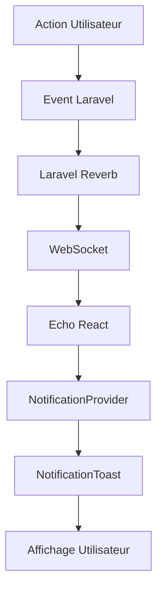

# Documentation: Configuration des Notifications Temps Réel avec Laravel Reverb + Inertia React TypeScript

## 📋 Vue d'ensemble

Cette documentation décrit la mise en place d'un système de notifications temps réel utilisant Laravel Reverb (WebSocket), Inertia.js et React TypeScript pour une application de notes collaboratives.

## 🏗️ Architecture du Système

### Backend (Laravel)
- **Laravel Reverb** : Serveur WebSocket pour la communication temps réel
- **Broadcasting** : Système de diffusion d'événements Laravel
- **Events** : Classes d'événements pour structurer les données diffusées
- **Channels** : Autorisation des canaux privés

### Frontend (React TypeScript)
- **NotificationProvider** : Context React pour gérer l'état des notifications
- **NotificationToast** : Composant d'affichage des notifications
- **Echo Configuration** : Configuration du client WebSocket
- **Error Boundary** : Gestion globale des erreurs React

## 📁 Structure des Fichiers

```
c:\Users\SNOM\Herd\reverb-notification\
├── config/
│   └── broadcasting.php                    # Configuration des canaux de diffusion
├── app/
│   └── Events/
│       └── NotificationSent.php           # Événement de notification
├── routes/
│   └── channels.php                       # Autorisation des canaux privés
├── resources/js/
│   ├── app.tsx                           # Configuration principale React
│   ├── Components/
│   │   ├── NotificationProvider.tsx      # Provider de notifications
│   │   └── NotificationToast.tsx         # Composant d'affichage
│   ├── hooks/
│   │   └── useNoteEvents.ts              # Hook pour événements de notes
│   └── pages/Notes/
│       └── Index.tsx                     # Page des notes (corrigée)
└── .env.example                          # Variables d'environnement
```

## 🔧 Configuration Backend

### 1. Configuration Broadcasting

```php
// config/broadcasting.php
return [
    'default' => env('BROADCAST_DRIVER', 'reverb'),
    'connections' => [
        'reverb' => [
            'driver' => 'reverb',
            'key' => env('REVERB_APP_KEY'),
            'secret' => env('REVERB_APP_SECRET'),
            'app_id' => env('REVERB_APP_ID'),
            'options' => [
                'host' => env('REVERB_HOST', '127.0.0.1'),
                'port' => env('REVERB_PORT', 8080),
                'scheme' => env('REVERB_SCHEME', 'http'),
                'useTLS' => env('REVERB_SCHEME', 'http') === 'https',
            ],
        ],
    ],
];
```

### 2. Événement de Notification

```php
// app/Events/NotificationSent.php
<?php

namespace App\Events;

use Illuminate\Broadcasting\Channel;
use Illuminate\Broadcasting\PrivateChannel;
use Illuminate\Contracts\Broadcasting\ShouldBroadcast;
use Illuminate\Foundation\Events\Dispatchable;

class NotificationSent implements ShouldBroadcast
{
    use Dispatchable;

    public function __construct(
        public string $message,
        public string $type = 'info',
        public ?int $userId = null
    ) {}

    public function broadcastOn(): array
    {
        return [
            $this->userId 
                ? new PrivateChannel('notifications.' . $this->userId)
                : new Channel('notifications')
        ];
    }

    public function broadcastAs(): string
    {
        return 'notification.sent';
    }

    public function broadcastWith(): array
    {
        return [
            'message' => $this->message,
            'type' => $this->type,
            'timestamp' => now()->format('Y-m-d H:i:s'),
        ];
    }
}
```

### 3. Autorisation des Canaux

```php
// routes/channels.php
<?php

use Illuminate\Support\Facades\Broadcast;

Broadcast::channel('notifications.{userId}', function ($user, $userId) {
    return (int) $user->id === (int) $userId;
});
```

## ⚛️ Configuration Frontend

### 1. Configuration Principale (app.tsx)

```tsx
// resources/js/app.tsx
import { ErrorBoundary } from 'react-error-boundary';
import { configureEcho } from '@laravel/echo-react';
import { NotificationProvider } from './components/NotificationProvider';
import NotificationToast from './components/NotificationToast';

function ErrorFallback({ error, resetErrorBoundary }) {
    return (
        <div className="min-h-screen flex items-center justify-center bg-gray-50">
            <div className="max-w-md w-full bg-white shadow-lg rounded-lg p-6">
                <h2 className="text-lg font-semibold text-gray-900">Something went wrong</h2>
                <p className="text-gray-600 mb-4">{error.message}</p>
                <button onClick={resetErrorBoundary}>Try again</button>
            </div>
        </div>
    );
}

configureEcho({
    broadcaster: 'reverb',
    key: import.meta.env.VITE_REVERB_APP_KEY,
    wsHost: import.meta.env.VITE_REVERB_HOST,
    wsPort: import.meta.env.VITE_REVERB_PORT ?? 8080,
    wssPort: import.meta.env.VITE_REVERB_PORT ?? 8080,
    forceTLS: (import.meta.env.VITE_REVERB_SCHEME ?? 'http') === 'https',
    enabledTransports: ['ws', 'wss'],
    disableStats: true,
});
```

### 2. Provider de Notifications

```tsx
// resources/js/components/NotificationProvider.tsx
import React, { createContext, useContext, useState, useEffect } from 'react';

interface Notification {
    id: string;
    message: string;
    type: 'success' | 'error' | 'warning' | 'info';
    timestamp: string;
}

const NotificationContext = createContext(undefined);

export const NotificationProvider = ({ children, userId }) => {
    const [notifications, setNotifications] = useState([]);

    useEffect(() => {
        const setupEchoListeners = () => {
            if (userId) {
                const privateChannel = window.Echo.private(`notifications.${userId}`);
                privateChannel.listen('.notification.sent', (e) => {
                    addNotification({
                        message: e.message,
                        type: e.type || 'info',
                        timestamp: e.timestamp,
                    });
                });
            }

            const publicChannel = window.Echo.channel('notifications');
            publicChannel.listen('.notification.sent', (e) => {
                addNotification({
                    message: e.message,
                    type: e.type || 'info',
                    timestamp: e.timestamp,
                });
            });
        };

        if (window.Echo) {
            setupEchoListeners();
        } else {
            setTimeout(() => setupEchoListeners(), 100);
        }
    }, [userId]);

    const addNotification = (notification) => {
        const id = Date.now().toString() + Math.random().toString(36).substr(2, 9);
        setNotifications(prev => [...prev, { ...notification, id }]);
        
        setTimeout(() => removeNotification(id), 5000);
    };

    return (
        <NotificationContext.Provider value={{ notifications, addNotification }}>
            {children}
        </NotificationContext.Provider>
    );
};
```

### 3. Composant Toast

```tsx
// resources/js/components/NotificationToast.tsx
import React from 'react';
import { useNotifications } from './NotificationProvider';

const NotificationToast = () => {
    const { notifications, removeNotification } = useNotifications();

    const getToastStyles = (type) => {
        const styles = {
            success: 'bg-green-500 text-white border-l-4 border-green-600',
            error: 'bg-red-500 text-white border-l-4 border-red-600',
            warning: 'bg-yellow-500 text-black border-l-4 border-yellow-600',
            info: 'bg-blue-500 text-white border-l-4 border-blue-600',
        };
        return `p-4 mb-3 rounded-lg shadow-lg transition-all duration-300 ${styles[type]}`;
    };

    if (notifications.length === 0) return null;

    return (
        <div className="fixed top-4 right-4 z-50 max-w-sm space-y-2">
            {notifications.map((notification) => (
                <div key={notification.id} className={getToastStyles(notification.type)}>
                    <div className="flex justify-between items-start">
                        <div className="flex-1">
                            <p className="font-medium">{notification.message}</p>
                            <p className="text-xs opacity-75 mt-1">
                                {new Date(notification.timestamp).toLocaleTimeString()}
                            </p>
                        </div>
                        <button
                            onClick={() => removeNotification(notification.id)}
                            className="ml-3 text-lg font-bold opacity-75 hover:opacity-100"
                        >
                            ×
                        </button>
                    </div>
                </div>
            ))}
        </div>
    );
};

export default NotificationToast;
```

## 🌐 Variables d'Environnement

```bash
# .env
BROADCAST_DRIVER=reverb

REVERB_APP_ID=your-app-id
REVERB_APP_KEY=your-app-key
REVERB_APP_SECRET=your-app-secret
REVERB_HOST=127.0.0.1
REVERB_PORT=8080
REVERB_SCHEME=http

VITE_REVERB_APP_KEY="${REVERB_APP_KEY}"
VITE_REVERB_HOST="${REVERB_HOST}"
VITE_REVERB_PORT="${REVERB_PORT}"
VITE_REVERB_SCHEME="${REVERB_SCHEME}"
```

## 📦 Installation et Démarrage

### Dépendances NPM
```bash
npm install laravel-echo pusher-js react-error-boundary @laravel/echo-react
```

### Commandes Laravel
```bash
# Démarrer le serveur WebSocket
php artisan reverb:start

# Traiter les événements en arrière-plan
php artisan queue:work

# Installer Reverb (si pas déjà fait)
php artisan install:broadcasting
```

## 🚀 Utilisation

### Déclencher une Notification (Backend)
```php
// Depuis n'importe où dans l'application Laravel
use App\Events\NotificationSent;

// Notification publique
NotificationSent::dispatch('Message pour tous', 'info');

// Notification privée pour un utilisateur
NotificationSent::dispatch('Message privé', 'success', $userId);
```

### Écouter les Notifications (Frontend)
Les notifications s'affichent automatiquement via le système `NotificationProvider` + `NotificationToast`.

## 🎨 Types de Notifications Supportés

| Type | Couleur | Icône | Usage |
|------|---------|-------|-------|
| `success` | Vert | ✓ | Opérations réussies |
| `error` | Rouge | ✗ | Erreurs |
| `warning` | Jaune | ⚠ | Avertissements |
| `info` | Bleu | ℹ | Informations générales |

## 🔒 Sécurité

### Canaux Privés
- Authentification requise via `routes/channels.php`
- Vérification de l'identité utilisateur
- Format : `notifications.{userId}`

### Canaux Publics
- Accessibles sans authentification
- Format : `notifications`

## 🛠️ Résolution des Problèmes

### 1. Erreur "echo.private is not a function"
**Cause** : Echo n'est pas complètement initialisé
**Solution** : Système de vérification avec timeout implémenté

### 2. Erreur "Cannot read properties of undefined"
**Cause** : Accès à des propriétés d'objets undefined
**Solution** : Optional chaining (`?.`) et valeurs par défaut

### 3. Connexion WebSocket échouée
**Vérifications** :
- [ ] Serveur Reverb démarré
- [ ] Port 8080 accessible
- [ ] Variables d'environnement correctes
- [ ] Firewall configuré

### 4. Notifications non reçues
**Vérifications** :
- [ ] Événements diffusés correctement
- [ ] Canaux correctement nommés
- [ ] Authentification pour canaux privés
- [ ] JavaScript sans erreurs

## 📊 Monitoring et Debug

### Logs Backend
```bash
# Logs Laravel
tail -f storage/logs/laravel.log

# Logs Reverb
php artisan reverb:start --debug
```

### Debug Frontend
```javascript
// Console du navigateur
console.log('Echo instance:', window.Echo);
console.log('Notifications:', notifications);
```

## 🔄 Flux de Données



## 📈 Optimisations Futures

- [ ] Persistance des notifications
- [ ] Pagination des notifications
- [ ] Notifications push
- [ ] Système de préférences utilisateur
- [ ] Analytics des notifications
- [ ] Cache Redis pour performances

## 📞 Support

Pour toute question ou problème :
1. Vérifier cette documentation
2. Consulter les logs d'erreur
3. Tester la configuration WebSocket
4. Vérifier les variables d'environnement

---

**Date de création** : $(date)
**Version** : 1.0.0
**Auteur** : GitHub Copilot
**Technologie** : Laravel Reverb + React TypeScript + Inertia.js
